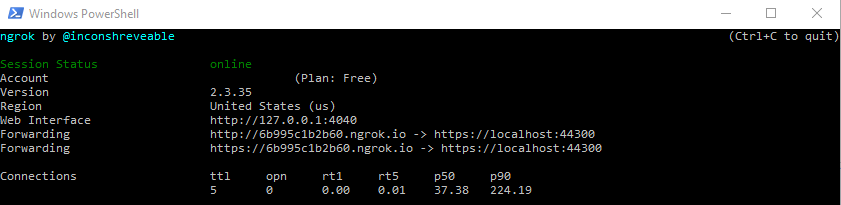
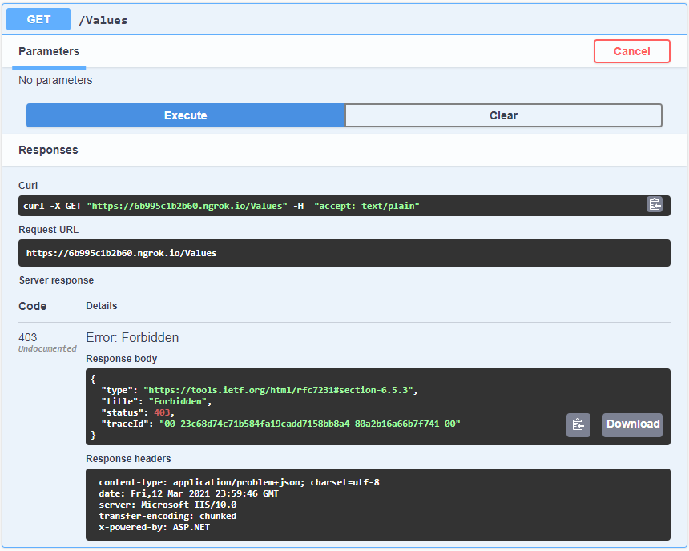

# Implementing and Testing IP SafeList in ASP.NET Core Web API projects

At times, it is necessary to restrict access to an application to specific IP addresses or network ranges. For instance, during beta testing, we might want to limit access to admins and selected testers only, rather than allowing everyone to access the new website. Additionally, we may want to expose most APIs but restrict certain endpoints to a confined network to prevent unauthorized access to sensitive data.

There are various levels at which IP restrictions can be implemented to enhance security. As developers, we can safeguard applications and API endpoints in our code, ensuring they are accessible only to a predefined list of network addresses. The official ASP.NET Core tutorial, _[Client IP safelist for ASP.NET Core](https://docs.microsoft.com/en-us/aspnet/core/security/ip-safelist)_ provides documentation on different approaches for implementing an IP address safelist (also known as an allowlist) in an ASP.NET Core app.

This article focuses on the implementation details of allowing a list of IP addresses or CIDR blocks to access our API endpoints. We will leverage the [IPNetwork2](https://www.nuget.org/packages/IPNetwork2/) NuGet package to parse and validate IP addresses and CIDR blocks. It is important to note that the [AzureIPNetworks](https://www.nuget.org/packages/AzureIPNetworks/) NuGet package also relies on IPNetwork2.

To achieve this, we will create a middleware and an action filter. Integration tests will be written to verify the request pipeline. Lastly, we will explore how to use ngrok, a reverse proxy tool, to test the application from other computers, extending beyond our local development machine.

## Testing with `ngrok`

`ngrok` is a reverse proxy that creates a secure tunnel from a public endpoint to a locally running web service.

To begin, download ngrok from its official site at [https://ngrok.com/](https://ngrok.com/). Once downloaded, start your application in Visual Studio (or VS Code) and run the ngrok executable in a PowerShell terminal using the following command:

```powershell
.\ngrok.exe http https://localhost:44300 -host-header="localhost:44300"
```



`ngrok` will generate a public endpoint, such as `https://6b995c1b2b60.ngrok.io`, which allows others to access your local development server at `https://localhost:44300`.

With ngrok in place, you can visit the URL provided by ngrok from another computer. In the example given, the link is [https://6b995c1b2b60.ngrok.io/swagger/index.html](https://6b995c1b2b60.ngrok.io/swagger/index.html). Please note that your link will be slightly different.

Try accessing the Swagger page, and you should observe the following results:



If your IP address is not in the safe list, you will receive a `403` response. Conversely, if your IP address is allowed, you will receive a `200` response.
